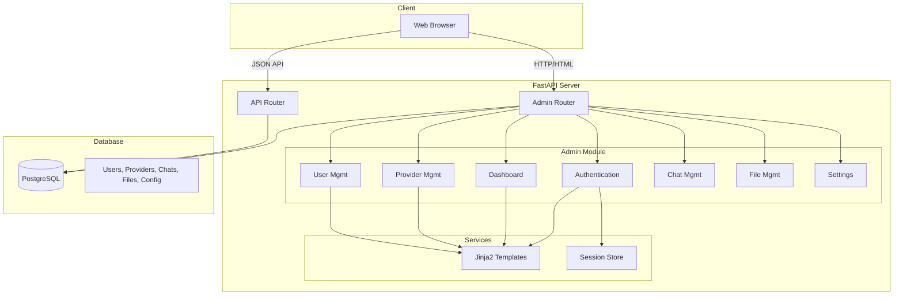

# WebUI Admin Panel Architecture Design

## Overview

This document outlines the architecture for a modern WebUI admin panel for the Altex FastAPI backend. The design prioritizes simplicity, rapid implementation, and ease of deployment while providing comprehensive administrative capabilities.

---

## 1. Technology Stack

### Recommended Stack: Jinja2 + HTMX + Tailwind CSS

| Component | Technology | Rationale |
|-----------|------------|-----------|
| **Templating** | Jinja2 | Native FastAPI support, no build step, Python ecosystem |
| **Interactivity** | HTMX 1.9+ | Server-side rendering, minimal JavaScript, hypermedia-driven |
| **Styling** | Tailwind CSS 3.4+ | Utility-first, rapid prototyping, CDN available |
| **Icons** | Heroicons | Consistent design, SVG icons, Tailwind integration |
| **JavaScript** | Vanilla JS + Alpine.js 3.x | Minimal enhancements, declarative bindings |

### Alternative Considered Stacks

| Option | Pros | Cons |
|--------|------|------|
| React SPA | Rich interactivity, large ecosystem | Build complexity, separate deployment |
| Vue.js | Progressive, good DX | Requires build tools |
| Pure Jinja2 + Vanilla JS | Simplest | More manual DOM manipulation |

### CDN Dependencies (No Build Required)

```html
<!-- Tailwind CSS -->
<script src="https://cdn.tailwindcss.com"></script>

<!-- HTMX -->
<script src="https://unpkg.com/htmx.org@1.9.10"></script>

<!-- Alpine.js for reactivity -->
<script defer src="https://cdn.jsdelivr.net/npm/alpinejs@3.x.x/dist/cdn.min.js"></script>

<!-- Heroicons (inline SVG recommended) -->
```

---

## 2. Feature List & Pages

### 2.1 Page Overview

```
┌─────────────────────────────────────────────────────────────────┐
│                        WebUI Admin Panel                        │
├─────────────────────────────────────────────────────────────────┤
│  /admin/login              - Admin Login Page                   │
│  /admin/dashboard          - Dashboard Overview                 │
│  /admin/providers          - Provider Management CRUD           │
│  /admin/models             - Model Configuration                │
│  /admin/users              - User Management CRUD               │
│  /admin/chats              - Chat History Viewer                │
│  /admin/files              - File Management                    │
│  /admin/settings           - System Settings                    │
└─────────────────────────────────────────────────────────────────┘
```

### 2.2 Detailed Page Specifications

#### Dashboard (`/admin/dashboard`)

**Purpose:** Overview of system status and statistics

**Components:**
- System health status card
- Total providers count (active/inactive)
- Total users count
- Total chats count
- Recent activity feed
- Quick action buttons

**Data Required:**
```python
{
    "providers": {"total": 5, "active": 4},
    "users": {"total": 10, "active": 9},
    "chats": {"total": 150, "today": 12},
    "files": {"total": 45, "size_mb": 120},
    "recent_activity": [...]
}
```

#### Provider Management (`/admin/providers`)

**Purpose:** CRUD operations for AI providers (vLLM, OpenAI, etc.)

**Actions:**
- List all providers with status indicators
- Create new provider (name, base_url, api_key, auth_type, prefix)
- Edit provider configuration
- Delete provider (with confirmation)
- Test provider connection
- Toggle active/inactive status

**Provider Model Fields:**
| Field | Type | Editable |
|-------|------|----------|
| id | UUID | No |
| name | string | Yes |
| base_url | string | Yes |
| api_key | string | Yes (masked) |
| auth_type | enum | Yes |
| prefix | string | Yes |
| is_active | boolean | Yes |
| extra_config | JSON | Yes |

#### Model Configuration (`/admin/models`)

**Purpose:** View and configure available models

**Actions:**
- List models from all active providers
- View model details (id, owned_by, context_window)
- Refresh model cache
- Configure model parameters (future)

**Model List Columns:**
| Column | Description |
|--------|-------------|
| Model ID | Model identifier |
| Provider | Source provider name |
| Owned By | Model creator |
| Context | Context window size |
| Status | Active/Available |

#### User Management (`/admin/users`)

**Purpose:** CRUD operations for users

**Actions:**
- List all users with pagination
- Create new user (email, name, password, role)
- Edit user details
- Toggle user active/inactive
- Delete user (with confirmation)
- View user's chat history

**User Model Fields:**
| Field | Type | Editable |
|-------|------|----------|
| id | UUID | No |
| email | string | Yes |
| name | string | Yes |
| role | enum (admin/user) | Yes |
| is_active | boolean | Yes |
| settings | JSON | Yes |

#### Chat Management (`/admin/chats`)

**Purpose:** View and manage chat history

**Actions:**
- List all chats with pagination
- Filter by user, date range, model
- View chat details (full conversation)
- Archive/unarchive chats
- Delete chats
- Export chat history

**Chat List Columns:**
| Column | Description |
|--------|-------------|
| Title | Chat title |
| User | Owner email |
| Model | Primary model used |
| Messages | Message count |
| Created | Creation timestamp |
| Updated | Last update timestamp |

#### File Management (`/admin/files`)

**Purpose:** Manage uploaded files for RAG

**Actions:**
- List all files with pagination
- View file metadata
- Download files
- Delete files (with vector cleanup)
- View chunk count and size

**File List Columns:**
| Column | Description |
|--------|-------------|
| Filename | Original filename |
| Type | Content type |
| Size | File size |
| Chunks | Vector chunks |
| Created | Upload timestamp |

#### System Settings (`/admin/settings`)

**Purpose:** Configure application settings

**Sections:**
- RAG Configuration (embedding, chunking)
- Web Search Configuration
- Feature Flags
- Storage Configuration
- Task Model Settings

**Editable Settings:**
```yaml
RAG:
  - embedding_engine
  - rag_embedding_model
  - embedding_dimension
  - chunk_size
  - chunk_overlap
  - rag_top_k
  - rag_relevance_threshold

Web Search:
  - enable_web_search
  - web_search_engine
  - search_result_count

Features:
  - enable_image_generation
  - enable_code_interpreter
  - enable_memory
  - enable_title_generation
```

#### Admin Login (`/admin/login`)

**Purpose:** Authenticate admin users

**Components:**
- Email input
- Password input
- Login button
- Error message display

---

## 3. API Endpoints

### 3.1 New Endpoints Required for WebUI

#### Admin Authentication

```
POST   /admin/api/login           - Admin login (session-based)
POST   /admin/api/logout          - Admin logout
GET    /admin/api/me              - Current admin user info
```

#### Dashboard Data

```
GET    /admin/api/dashboard       - Dashboard statistics
```

#### Provider Management (Enhance Existing)

```
GET    /admin/providers           - Provider list page (HTML)
POST   /admin/providers           - Create provider (form data)
GET    /admin/providers/{id}      - Provider edit page (HTML)
PUT    /admin/providers/{id}      - Update provider (form data)
DELETE /admin/providers/{id}      - Delete provider
POST   /admin/providers/{id}/toggle - Toggle active status
```

#### User Management (New)

```
GET    /admin/users               - User list page (HTML)
POST   /admin/users               - Create user (form data)
GET    /admin/users/{id}          - User edit page (HTML)
PUT    /admin/users/{id}          - Update user (form data)
DELETE /admin/users/{id}          - Delete user
POST   /admin/users/{id}/toggle   - Toggle active status
```

#### Chat Management (Enhance Existing)

```
GET    /admin/chats               - Chat list page (HTML)
GET    /admin/chats/{id}          - Chat detail page (HTML)
DELETE /admin/chats/{id}          - Delete chat
POST   /admin/chats/{id}/archive  - Archive chat
```

#### File Management (Enhance Existing)

```
GET    /admin/files               - File list page (HTML)
GET    /admin/files/{id}          - File detail page (HTML)
DELETE /admin/files/{id}          - Delete file
GET    /admin/files/{id}/download - Download file
```

#### Settings Management (New)

```
GET    /admin/settings            - Settings page (HTML)
PUT    /admin/settings            - Update settings (form data)
POST   /admin/settings/test       - Test configuration
```

### 3.2 Existing API Endpoints to Reuse

| Endpoint | Method | Purpose |
|----------|--------|---------|
| `/api/providers` | GET, POST | List/create providers |
| `/api/providers/{id}` | GET, PUT, DELETE | Provider CRUD |
| `/api/providers/{id}/test` | POST | Test connection |
| `/api/models` | GET | List models |
| `/api/models/refresh` | POST | Refresh model cache |
| `/api/chats` | GET | List chats |
| `/api/files` | GET | List files |
| `/api/config` | GET | Get configuration |
| `/api/config/rag` | GET | RAG configuration |
| `/api/config/features` | GET | Feature flags |

---

## 4. File Structure

```
backend-altex/
├── main.py                     # Existing - add admin router mounts
├── database.py                 # Existing
├── config.py                   # Existing
├── env.py                      # Existing
│
├── admin/                      # NEW - Admin module
│   ├── __init__.py
│   ├── router.py               # Main admin router
│   ├── auth.py                 # Admin authentication logic
│   ├── dependencies.py         # Auth dependencies
│   └── utils.py                # Admin helper functions
│
├── templates/                  # NEW - Jinja2 templates
│   ├── base.html               # Base layout with navigation
│   ├── components/             # Reusable components
│   │   ├── navigation.html     # Sidebar navigation
│   │   ├── alerts.html         # Alert messages
│   │   ├── tables.html         # Table components
│   │   ├── forms.html          # Form components
│   │   └── modals.html         # Modal dialogs
│   │
│   ├── admin/                  # Admin pages
│   │   ├── login.html          # Login page
│   │   ├── dashboard.html      # Dashboard
│   │   ├── providers/
│   │   │   ├── list.html       # Provider list
│   │   │   ├── form.html       # Create/Edit form
│   │   │   └── row.html        # Table row (HTMX partial)
│   │   ├── models/
│   │   │   └── list.html       # Model list
│   │   ├── users/
│   │   │   ├── list.html       # User list
│   │   │   ├── form.html       # Create/Edit form
│   │   │   └── row.html        # Table row (HTMX partial)
│   │   ├── chats/
│   │   │   ├── list.html       # Chat list
│   │   │   └── detail.html     # Chat detail view
│   │   ├── files/
│   │   │   ├── list.html       # File list
│   │   │   └── detail.html     # File detail
│   │   └── settings/
│   │       └── index.html      # Settings page
│   │
│   └── errors/                 # Error pages
│       ├── 401.html
│       ├── 403.html
│       └── 404.html
│
├── static/                     # NEW - Static files
│   ├── css/
│   │   └── custom.css          # Custom styles (minimal)
│   ├── js/
│   │   └── admin.js            # Admin-specific JS
│   └── img/
│       └── logo.svg            # Admin logo
│
├── routers/                    # Existing API routers
├── models/                     # Existing ORM models
├── utils/                      # Existing utilities
└── migrations/                 # Existing migrations
```

---

## 5. Database Operations

### 5.1 Tables Managed via WebUI

| Table | Model | Operations |
|-------|-------|------------|
| `users` | [`User`](models/users.py) | CRUD, Toggle active |
| `providers` | [`Provider`](models/providers.py) | CRUD, Toggle active, Test |
| `chats` | [`Chat`](models/chats.py) | Read, Archive, Delete |
| `files` | [`File`](models/files.py) | Read, Delete |
| `app_config` | [`Config`](config.py) | Read, Update |

### 5.2 Required Database Queries

#### Dashboard Statistics

```sql
-- Provider counts
SELECT COUNT(*) as total, 
       SUM(CASE WHEN is_active THEN 1 ELSE 0 END) as active
FROM providers;

-- User counts
SELECT COUNT(*) as total,
       SUM(CASE WHEN is_active THEN 1 ELSE 0 END) as active
FROM users;

-- Chat counts
SELECT COUNT(*) as total,
       SUM(CASE WHEN updated_at > EXTRACT(EPOCH FROM NOW() - INTERVAL '24 hours') * 1e9 THEN 1 ELSE 0 END) as today
FROM chats;

-- File statistics
SELECT COUNT(*) as total,
       SUM(size_bytes) / 1048576.0 as size_mb
FROM files;
```

#### User List with Pagination

```sql
SELECT id, email, name, role, is_active, created_at, updated_at
FROM users
ORDER BY created_at DESC
LIMIT :limit OFFSET :offset;
```

#### Chat List with Filters

```sql
SELECT c.id, c.title, c.user_id, c.is_archived, c.created_at, c.updated_at,
       u.email as user_email
FROM chats c
LEFT JOIN users u ON c.user_id = u.id
WHERE (:user_id IS NULL OR c.user_id = :user_id)
  AND (:archived IS NULL OR c.is_archived = :archived)
ORDER BY c.updated_at DESC
LIMIT :limit OFFSET :offset;
```

### 5.3 Admin Session Management

```sql
-- Optional: Create admin_sessions table for session tracking
CREATE TABLE IF NOT EXISTS admin_sessions (
    id UUID PRIMARY KEY DEFAULT gen_random_uuid(),
    user_id UUID NOT NULL REFERENCES users(id) ON DELETE CASCADE,
    token_hash VARCHAR(64) NOT NULL,
    expires_at TIMESTAMP NOT NULL,
    created_at TIMESTAMP DEFAULT NOW()
);

CREATE INDEX idx_admin_sessions_token ON admin_sessions(token_hash);
CREATE INDEX idx_admin_sessions_user ON admin_sessions(user_id);
```

---

## 6. Security Considerations

### 6.1 Admin Authentication

**Approach:** Session-based authentication with HTTP-only cookies

```python
# admin/auth.py
from fastapi import Request, Response
from passlib.context import CryptContext
import secrets
import time

pwd_context = CryptContext(schemes=["bcrypt"], deprecated="auto")

async def create_admin_session(response: Response, user_id: str):
    """Create admin session with secure cookie."""
    token = secrets.token_urlsafe(32)
    expires = time.time() + (7 * 24 * 60 * 60)  # 7 days
    
    response.set_cookie(
        key="admin_session",
        value=token,
        httponly=True,
        secure=True,  # HTTPS only
        samesite="strict",
        max_age=7 * 24 * 60 * 60
    )
    
    # Store session in database
    # ...

async def verify_admin_session(request: Request) -> dict | None:
    """Verify admin session from cookie."""
    token = request.cookies.get("admin_session")
    if not token:
        return None
    # Verify token against database
    # ...
```

### 6.2 Authorization

**Role-based Access Control:**

```python
# admin/dependencies.py
from fastapi import Depends, HTTPException, Request

async def get_current_admin(request: Request) -> dict:
    """Dependency to get current admin user."""
    user = await verify_admin_session(request)
    if not user:
        raise HTTPException(status_code=302, headers={"Location": "/admin/login"})
    if user.get("role") != "admin":
        raise HTTPException(status_code=403, detail="Admin access required")
    return user

# Usage in router
@router.get("/dashboard")
async def dashboard(admin: dict = Depends(get_current_admin)):
    return templates.TemplateResponse("admin/dashboard.html", {"admin": admin})
```

### 6.3 CSRF Protection

**Implementation using HTMX headers:**

```python
# middleware/csrf.py
from fastapi import Request, HTTPException
import secrets

def generate_csrf_token() -> str:
    return secrets.token_urlsafe(32)

async def verify_csrf(request: Request):
    """Verify CSRF token from HTMX header."""
    if request.method in ["POST", "PUT", "DELETE"]:
        token = request.headers.get("X-CSRF-Token")
        cookie_token = request.cookies.get("csrf_token")
        
        if not token or token != cookie_token:
            raise HTTPException(status_code=403, detail="CSRF validation failed")
```

**CSRF token in templates:**

```html
<form hx-post="/admin/providers" hx-headers='{"X-CSRF-Token": "{{ csrf_token }}"}'>
    <!-- form fields -->
</form>
```

### 6.4 Input Validation

**Using Pydantic models for form validation:**

```python
# admin/schemas.py
from pydantic import BaseModel, EmailStr, field_validator
import re

class ProviderCreate(BaseModel):
    name: str
    base_url: str
    api_key: str | None = None
    auth_type: str = "bearer"
    prefix: str | None = None
    
    @field_validator("base_url")
    @classmethod
    def validate_url(cls, v):
        if not v.startswith(("http://", "https://")):
            raise ValueError("base_url must start with http:// or https://")
        return v.rstrip("/")

class UserCreate(BaseModel):
    email: EmailStr
    name: str
    password: str
    role: str = "user"
    
    @field_validator("password")
    @classmethod
    def validate_password(cls, v):
        if len(v) < 8:
            raise ValueError("Password must be at least 8 characters")
        return v
```

### 6.5 Security Headers

**Add security headers middleware:**

```python
# utils/middleware.py
from starlette.middleware.base import BaseHTTPMiddleware

class SecurityHeadersMiddleware(BaseHTTPMiddleware):
    async def dispatch(self, request, call_next):
        response = await call_next(request)
        
        # Apply to admin routes only
        if request.url.path.startswith("/admin"):
            response.headers["X-Content-Type-Options"] = "nosniff"
            response.headers["X-Frame-Options"] = "DENY"
            response.headers["X-XSS-Protection"] = "1; mode=block"
            response.headers["Content-Security-Policy"] = (
                "default-src 'self'; "
                "script-src 'self' 'unsafe-inline' 'unsafe-eval' https://cdn.tailwindcss.com https://unpkg.com https://cdn.jsdelivr.net; "
                "style-src 'self' 'unsafe-inline'; "
                "img-src 'self' data:;"
            )
        
        return response
```

---

## 7. Implementation Architecture Diagram



---

## 8. HTMX Interaction Patterns

### 8.1 List with Inline Editing

```html
<!-- templates/admin/providers/list.html -->
<div id="provider-list">
    <table class="min-w-full divide-y divide-gray-200">
        <thead>
            <tr>
                <th>Name</th>
                <th>Base URL</th>
                <th>Status</th>
                <th>Actions</th>
            </tr>
        </thead>
        <tbody id="provider-rows">
            
            <tr id="provider-{{ provider.id }}" hx-get="/admin/providers/{{ provider.id }}/row" 
                hx-trigger="reload from:body" hx-swap="outerHTML">
                
            </tr>
            
        </tbody>
    </table>
</div>
```

### 8.2 Form Submission with Validation

```html
<!-- templates/admin/providers/form.html -->
<form id="provider-form" hx-post="/admin/providers" 
      hx-target="#provider-list" hx-swap="beforeend"
      hx-headers='{"X-CSRF-Token": "{{ csrf_token }}"}'>
    
    <div class="mb-4">
        <label class="block text-sm font-medium">Name</label>
        <input type="text" name="name" required 
               class="mt-1 block w-full rounded-md border-gray-300 shadow-sm">
    </div>
    
    <div class="mb-4">
        <label class="block text-sm font-medium">Base URL</label>
        <input type="url" name="base_url" required 
               class="mt-1 block w-full rounded-md border-gray-300 shadow-sm">
    </div>
    
    <div class="mb-4">
        <label class="block text-sm font-medium">API Key</label>
        <input type="password" name="api_key" 
               class="mt-1 block w-full rounded-md border-gray-300 shadow-sm">
    </div>
    
    <button type="submit" class="bg-blue-600 text-white px-4 py-2 rounded">
        Create Provider
    </button>
</form>

<!-- Show success/error messages -->
<div id="form-message" class="mt-4"></div>
```

### 8.3 Delete with Confirmation

```html
<!-- templates/admin/providers/row.html -->
<td>
    <button hx-delete="/admin/providers/{{ provider.id }}"
            hx-target="#provider-{{ provider.id }}"
            hx-swap="outerHTML swap:0.5s"
            hx-confirm="Are you sure you want to delete this provider?"
            class="text-red-600 hover:text-red-800">
        Delete
    </button>
</td>
```

---

## 9. Implementation Roadmap

### Phase 1: Foundation
- [ ] Create admin module structure
- [ ] Implement base templates with navigation
- [ ] Add admin authentication system
- [ ] Create dashboard page with statistics

### Phase 2: Core CRUD
- [ ] Implement provider management pages
- [ ] Implement user management pages
- [ ] Add form validation and error handling
- [ ] Implement CSRF protection

### Phase 3: Extended Features
- [ ] Add model configuration page
- [ ] Implement chat history viewer
- [ ] Add file management interface
- [ ] Create settings page

### Phase 4: Polish
- [ ] Add loading indicators
- [ ] Implement toast notifications
- [ ] Add pagination controls
- [ ] Mobile responsive design

---

## 10. Dependencies to Add

Update [`requirements.txt`](requirements.txt):

```txt
# WebUI Dependencies
jinja2>=3.1.2
python-multipart>=0.0.6
itsdangerous>=2.1.2  # For session signing
```

---

## 11. Sample Implementation: Admin Router

```python
# admin/router.py
from fastapi import APIRouter, Request, Depends, Form, HTTPException
from fastapi.responses import HTMLResponse, RedirectResponse
from fastapi.templating import Jinja2Templates

from database import async_session_factory
from models.providers import Provider
from models.users import User
from admin.dependencies import get_current_admin
from admin.auth import verify_csrf

router = APIRouter(prefix="/admin", tags=["Admin"])
templates = Jinja2Templates(directory="templates")

@router.get("/", response_class=HTMLResponse)
async def admin_root():
    """Redirect to dashboard."""
    return RedirectResponse(url="/admin/dashboard")

@router.get("/login", response_class=HTMLResponse)
async def login_page(request: Request):
    """Render login page."""
    return templates.TemplateResponse("admin/login.html", {"request": request})

@router.post("/login", response_class=HTMLResponse)
async def login(
    request: Request,
    email: str = Form(...),
    password: str = Form(...),
):
    """Process login."""
    # Verify credentials
    # Create session
    # Redirect to dashboard
    pass

@router.get("/dashboard", response_class=HTMLResponse)
async def dashboard(
    request: Request,
    admin: dict = Depends(get_current_admin)
):
    """Render dashboard."""
    async with async_session_factory() as db:
        providers = await Provider.get_all(db)
        users = await User.get_all(db)
        # Get more stats...
    
    return templates.TemplateResponse("admin/dashboard.html", {
        "request": request,
        "admin": admin,
        "stats": {
            "providers": {"total": len(providers), "active": sum(1 for p in providers if p.is_active)},
            "users": {"total": len(users), "active": sum(1 for u in users if u.is_active)},
        }
    })

@router.get("/providers", response_class=HTMLResponse)
async def providers_list(
    request: Request,
    admin: dict = Depends(get_current_admin)
):
    """Render provider list."""
    async with async_session_factory() as db:
        providers = await Provider.get_all(db)
    
    return templates.TemplateResponse("admin/providers/list.html", {
        "request": request,
        "admin": admin,
        "providers": providers
    })
```

---

## Summary

This architecture provides a practical, rapidly implementable WebUI admin panel using:

1. **Jinja2 + HTMX + Tailwind CSS** - Minimal complexity, no build step
2. **Session-based authentication** - Secure admin access with HTTP-only cookies
3. **Comprehensive CRUD operations** - Full management of providers, users, chats, files
4. **Security-first approach** - CSRF protection, input validation, security headers
5. **Incremental enhancement** - HTMX enables progressive interactivity

The design leverages existing API endpoints where possible and adds new admin-specific routes for web interface functionality.
